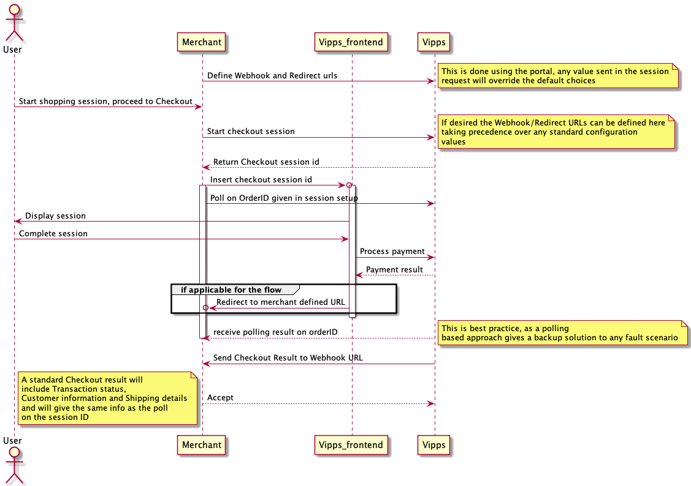

# Vipps Checkout guide

VipVipps Checkout is designed to be a low friction low complexity flow where Vipps Checkout ensures a smooth and efficient checkout experience using the trusted Vipps technology and brand.

Preliminary documentation. Subject to change

- [Vipps Checkout guide](#vipps-checkout-guide)
- [Flow diagram](#flow-diagram)
- [Example integration](#example-integration)
- [Call by call flow](#call-by-call-flow)

# Flow diagram

The standard flow for a Vipps Checkout consists of

1. Generation of a session.
2. Displaying that session in a Vipps Checkout iframe.
3. The user completing checkout process.
4. The Merchant handling the result of the Checkout process.




# Example integration

First you need to request a Vipps Checkout Session token from the Vipps APIs. The first thing you need to do is set up a server server request to set up a Checkout session. An example implementation can be found [here](www.example.com) 

Request a session token acording to your needs, the full specification of the Checkout session endpoint can be found [here](https://fantastic-fiesta-211ff2ad.pages.github.io/#/Checkout/get_Checkout)

A minimal example with example values:

```json

--header 'client_id: Insert client_ID value' 
--header 'client_secret: Insert client_ID value' 
--header 'Ocp-Apim-Subscription-Key: Insert Ocp-Apim-Subscription-Key value' 

{
  "merchantInfo": {
    "merchantSerialNumber": "123456",
    "callbackPrefix":"https://example.com/vipps/callbacks-for-payment-update",
    "fallBack": "https://example.com/vipps/fallback-result-page/order123abc"
  },
  "transaction": {
    "orderId": "order123abc",
    "amount": 20000,
    "transactionText": "One pair of Vipps socks"
  }
}
```

Example response:

```json
{
  "token": "fjepo1393_31f01f109d213"
}
```


Then set up the iframe to host the Vipps Checkout in your frontend

```
<script>
      var merchantBackendUrl = '<%= merchantBackendUrl %>';
      var checkoutFrontendUrl = '<%= checkoutFrontendUrl %>';
      var frameContainer = document.getElementById('checkout-frame-container');

      var iframe = document.createElement('iframe');

      document.getElementById('checkout-button').addEventListener('click', function () {
        var data = {
          amount: '1600000',
        };

        fetch(merchantBackendUrl + '/create-checkout-session', {
          method: 'POST',
          headers: {
            'Content-Type': 'application/json',
          },
          body: JSON.stringify(data),
        })
          .then((response) => response.json())
          .then((data) => {
            iframe.src = checkoutFrontendUrl + '/?token=' + data.token;
            iframe.classList.add('checkout-frame');
            iframe.frameBorder = '0';
            iframe.height = '1500px';
            iframe.id = frameContainer.appendChild(iframe);
          })
          .catch((error) => {
            console.error('Error:', error);
          });
      });
    </script>
```

Insert the token into the iframe and display it to the Customer. 

The user then completes the session in the Iframe and 

# Call by call flow